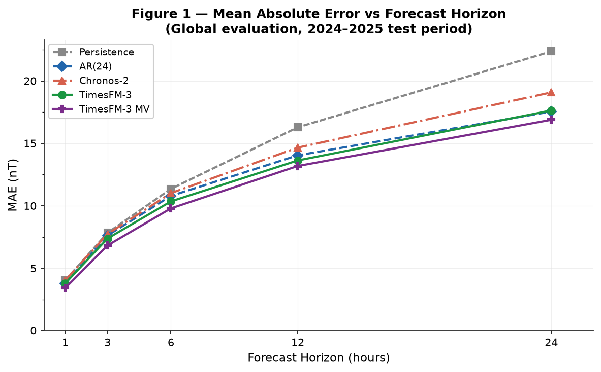
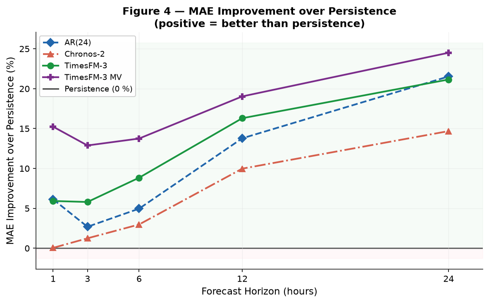
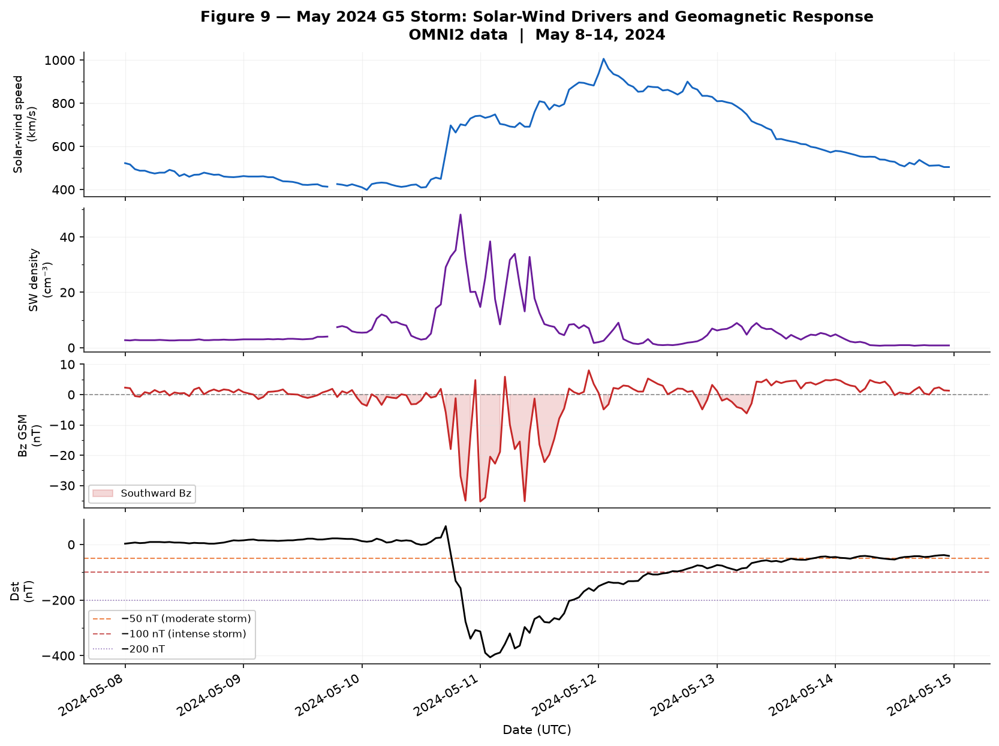
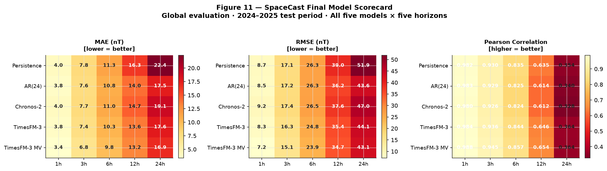

[README (2).md](https://github.com/user-attachments/files/32047964/README.2.md)
# 🌌 SpaceCast

**Geomagnetic space-weather forecasting with pretrained Time-Series Foundation Models**


SpaceCast benchmarks two modern Time-Series Foundation Models — **Chronos-2** (Amazon) and **TimesFM-3** (Google) — against classical statistical baselines on the task of forecasting the **Dst geomagnetic index**, using 9+ years of real NASA OMNI2 solar-wind and geomagnetic data. It evaluates every model zero-shot, at five forecast horizons, under both normal and storm-time conditions, including a case study of the **May 2024 G5 storm** — the most intense geomagnetic event in two decades.

> Solar-wind / geomagnetic observations → Time-Series Foundation Model → forecast → rigorous evaluation → visualization

---

## Table of Contents

- [Why This Project](#why-this-project)
- [Key Results](#key-results)
- [Figures](#figures)
- [Methodology](#methodology)
- [Models Evaluated](#models-evaluated)
- [Repository Structure](#repository-structure)
- [Getting Started](#getting-started)
- [Data](#data)
- [Notebooks](#notebooks)
- [Testing](#testing)
- [Limitations & Future Work](#limitations--future-work)
- [References](#references)

---

## Why This Project

Geomagnetic storms — driven by solar-wind disturbances slamming into Earth's magnetosphere — can disrupt satellites, power grids, and GPS/HF radio. The **Dst index** (Disturbance Storm Time, in nT) is a standard measure of storm intensity: the more negative, the more severe the disturbance.

SpaceCast asks three concrete questions:

1. Can general-purpose, pretrained **Time-Series Foundation Models** (never fine-tuned on space physics) forecast Dst competitively against purpose-built statistical baselines?
2. Does giving a TSFM access to **upstream physical solar-wind covariates** (IMF Bz, solar-wind speed, density, dynamic pressure, electric field) — with a strictly zero-leakage, past-only covariate strategy — improve its forecasts?
3. Do these results hold up under **geomagnetic storm conditions**, where accuracy matters most operationally?

All experiments are run **zero-shot** (no fine-tuning), evaluated on a strictly held-out **2024–2025** test period, and validated for data-leakage-free chronological integrity throughout.

---

## Key Results

*(MAE in nT, lower is better. Full test period, 2024–2025, held-out. See [`reports/results/`](reports/results/) for raw CSVs.)*

| Horizon | Persistence | AR(24) | Chronos-2 | TimesFM-3 | **TimesFM-3 (multivariate)** |
|:---:|:---:|:---:|:---:|:---:|:---:|
| 1 h  | 4.03 | 3.78 | 4.03 | 3.79 | **3.42** 🥇 |
| 3 h  | 7.83 | 7.62 | 7.73 | 7.38 | **6.82** 🥇 |
| 6 h  | 11.35 | 10.79 | 11.01 | 10.35 | **9.79** 🥇 |
| 12 h | 16.28 | 14.03 | 14.65 | 13.62 | **13.18** 🥇 |
| 24 h | 22.36 | 17.54 | 19.07 | 17.63 | **16.88** 🥇 |

**Headline findings:**

- **TimesFM-3 (multivariate) wins at every horizon**, improving on persistence by up to ~15% and consistently beating the univariate version by ~3–10%, confirming that recent solar-wind history carries predictive information about Dst beyond what the Dst series alone provides.
- **Persistence is genuinely hard to beat at 1 h** — Dst's lag-1 autocorrelation is ~0.98 — but degrades sharply beyond 6 h as storms evolve.
- **AR(24), a simple linear autoregression, is a strong and underrated baseline**, closely tracking TimesFM-3 at longer horizons.
- **Chronos-2 does not consistently beat AR(24) or persistence**, especially during storms — its RMSE shows a heavier tail of large misses, suggesting it is less well-calibrated for extreme geomagnetic excursions.
- **Storm-time errors dwarf global averages.** During intense storms (Dst < −100 nT), 24 h MAE reaches 175–237 nT across all models — roughly 10× the global 24 h error — showing that extreme-event forecasting from Dst history alone remains an unsolved problem.

**May 2024 G5 storm (case study):** Dst reached **−406 nT**, solar-wind speed peaked at **1,006 km/s**, and Bz GSM dropped to **−35 nT** — the most extreme event in the test window and the dominant contributor to all storm-conditioned metrics above.

---

## Figures

All figures are generated in [`notebooks/06_visualization.ipynb`](notebooks/06_visualization.ipynb) and saved to [`reports/figures/`](reports/figures/).

| | |
|---|---|
|  |  |
| **Fig 1.** MAE vs forecast horizon, all 5 models | **Fig 4.** % improvement over the persistence baseline |
|  |  |
| **Fig 9.** May 2024 G5 storm — solar-wind drivers and Dst response | **Fig 11.** Final model scorecard across all metrics and horizons |

*(See `reports/figures/` for the full set of 11 figures, including RMSE, correlation, storm-conditioned, and covariate-benefit plots.)*

---

## Methodology

**Data.** Hourly [NASA OMNI2](https://omniweb.gsfc.nasa.gov/) dataset (2016–2025): solar-wind plasma parameters (speed, density, temperature), interplanetary magnetic field (GSE/GSM coordinates), derived quantities (dynamic pressure, IEF), and geomagnetic indices (Dst, Kp, AE). Dst is the sole forecasting target; it has 0% missingness in the cleaned dataset.

**Split.** Strict chronological split — train on **2016–2023**, test on the held-out **2024–2025** period. No future information ever leaks into training or forecasting.

**Horizons.** 1 h, 3 h, 6 h, 12 h, 24 h ahead.

**Baselines.**
- **Persistence** — `forecast(t+h) = actual(t)`, the strongest short-horizon reference given Dst's high autocorrelation.
- **AR(24)** — linear autoregression on the last 24 hourly lags, refit on training data only.

**Foundation models (zero-shot, no fine-tuning).**
- **Chronos-2** (Amazon) — univariate, tokenized probabilistic forecasting.
- **TimesFM-3** (Google) — evaluated both univariate (Dst history only) and **multivariate**, using its native `past_only_covariates` API to incorporate Bz GSM, solar-wind speed, density, dynamic pressure, and electric field — *strictly as past-only context, never as fabricated future values* — for zero data leakage.

**Evaluation.** MAE, RMSE, and Pearson correlation at each horizon, computed both globally and conditioned on storm intensity (Dst < −50 nT / < −100 nT), with storm populations defined by the **actual** target value so every model is judged on an identical set of hard cases. Forecast origins are sampled on a stride (every 12 h globally, every 1 h during the May 2024 storm window) for CPU-feasible, scientifically defensible coverage — with the explicit caveat that overlapping windows mean these are descriptive comparisons, not formally independent statistical tests.

The notebooks are intentionally split by responsibility: **04** generates forecasts and saves metrics, **05** performs numerical evaluation and interpretation, **06** turns everything into publication-quality figures — no model is ever re-run outside notebook 04.

---

## Models Evaluated

| Model | Type | Training | Covariates |
|---|---|---|---|
| Persistence | Statistical baseline | None | Dst only |
| AR(24) | Statistical baseline | 2016–2023 | Dst only |
| Chronos-2 | TSFM (Amazon), zero-shot | Pretrained | Dst only |
| TimesFM-3 (univariate) | TSFM (Google), zero-shot | Pretrained | Dst only |
| TimesFM-3 (multivariate) | TSFM (Google), zero-shot | Pretrained | Dst + 5 solar-wind variables |

---

## Repository Structure

```
SpaceCast/
├── data/
│   ├── raw/                 # OMNI2 raw downloads (gitignored — see Data section)
│   ├── interim/              # Intermediate cleaning outputs (gitignored)
│   └── processed/            # Final cleaned dataset (gitignored)
├── notebooks/
│   ├── 01_data_exploration.ipynb
│   ├── 02_space_weather_analysis.ipynb
│   ├── 03_baseline_models.ipynb
│   ├── 04_chronos_forecasting.ipynb   # Forecast generation (all models)
│   ├── 05_evaluation.ipynb            # Numerical evaluation & interpretation
│   └── 06_visualization.ipynb         # Publication-quality figures
├── reports/
│   ├── figures/               # 11 generated figures (PNG)
│   └── results/                # Saved metric CSVs
├── src/spacecast/
│   ├── config.py              # Target variables, horizon, seed
│   ├── data/                   # Download, cleaning, preprocessing
│   ├── models/                 # Baselines, TSFM wrappers
│   ├── evaluation/              # Metrics, backtesting
│   └── visualization/           # Plotting utilities
├── tests/                     # Unit tests (pytest)
└── pyproject.toml
```

---

## Getting Started

### Requirements

- Python **3.11+**
- ~4 GB+ free RAM for TSFM inference (both models are run on CPU by default)

### Installation

```bash
git clone https://github.com/Shaleen-Garg/SpaceCast--Space-Weather-Forecasting.git
cd SpaceCast--Space-Weather-Forecasting

# Editable install with all core dependencies
pip install -e .

# Optional: dev tools (pytest, black, flake8, isort)
pip install -e ".[dev]"
```

> **Note:** TimesFM-3 is not distributed on PyPI. Clone and install it from source per the [official repo](https://github.com/google-research/timesfm):
> ```bash
> git clone https://github.com/google-research/timesfm.git
> pip install -e timesfm/
> ```

### Running the pipeline

The project is notebook-driven. Run them in order:

```bash
jupyter lab notebooks/
```

1. `01_data_exploration.ipynb` → `02_space_weather_analysis.ipynb` — inspect and understand the data
2. `03_baseline_models.ipynb` — persistence & AR(24) baselines
3. `04_chronos_forecasting.ipynb` — generate all TSFM forecasts (produces the CSVs in `reports/results/`)
4. `05_evaluation.ipynb` — rigorous numerical evaluation
5. `06_visualization.ipynb` — regenerate all figures in `reports/figures/`

---

## Data

SpaceCast uses the **NASA OMNI2** hourly dataset, freely available at **[omniweb.gsfc.nasa.gov](https://omniweb.gsfc.nasa.gov/)**. Raw, interim, and processed data are excluded from version control (see `.gitignore`) — download and place OMNI2 data under `data/raw/` before running notebook 01; the cleaned output is expected at `data/processed/omni2_2016_2025_clean.csv` by notebook 03 onward.

Key variables used:

| Variable | Meaning |
|---|---|
| `Dst_nT` | Forecasting target — ring-current disturbance index |
| `Bz_gsm_nT` | North–south IMF component (GSM) — primary geoeffective driver |
| `speed_km_s` | Solar-wind bulk flow speed |
| `density_cm3` | Solar-wind proton density |
| `flow_pressure_nPa` | Solar-wind dynamic pressure |
| `electric_field_mV_m` | Interplanetary convective electric field |

---

## Notebooks

| # | Notebook | Purpose |
|---|---|---|
| 01 | Data Exploration | Dataset availability, sampling frequency, missingness, statistics |
| 02 | Space Weather Analysis | Physical relationships between solar wind, IMF, and geomagnetic indices |
| 03 | Baseline Models | Persistence, training-mean, and AR(24) baselines with storm-conditional evaluation |
| 04 | Chronos/TimesFM Forecasting | Zero-shot TSFM forecasting (univariate + multivariate), all saved metrics |
| 05 | Evaluation | Rigorous cross-model comparison, storm analysis, uncertainty discussion |
| 06 | Visualization | Final publication-quality figures and model scorecard |

---

## Testing

```bash
pytest tests/
```

---

## Limitations & Future Work

- **No quantile serialization:** TimesFM-3 and Chronos-2 return full quantile forecasts, but per-origin quantile arrays weren't saved to disk in this run — full probabilistic calibration (coverage, sharpness) is not currently computable from saved artifacts.
- **Single dominant storm event:** The May 2024 G5 storm heavily influences all storm-conditioned metrics; results should not be generalized to all future storms without validation on independent events.
- **Zero-shot only:** No TSFM was fine-tuned on Dst history — domain-adapted fine-tuning is likely the highest-impact next step.
- **Past-only covariates:** The multivariate model has no access to real-time or forecasted future solar-wind conditions (e.g., DSCOVR/ACE L1 real-time feeds), which could extend predictive skill further.
- **Descriptive, not inferential:** Forecast origins overlap substantially; reported metrics are descriptive performance summaries rather than the result of formal significance testing.

Planned next steps: save full quantile arrays for calibration analysis, fine-tune TimesFM-3 on the training period, incorporate real-time L1 covariates, and expand the test period to cover a broader range of solar-cycle activity.

---

## References

- Data: [NASA OMNIWeb](https://omniweb.gsfc.nasa.gov/)
- [Chronos: Learning the Language of Time Series](https://github.com/amazon-science/chronos-forecasting) (Amazon)
- [TimesFM](https://github.com/google-research/timesfm) (Google Research)

---

*SpaceCast is an end-to-end demonstration of applying general-purpose Time-Series Foundation Models to a physically grounded, high-stakes forecasting problem — evaluated with the same rigor a space-weather forecasting center would demand.*
